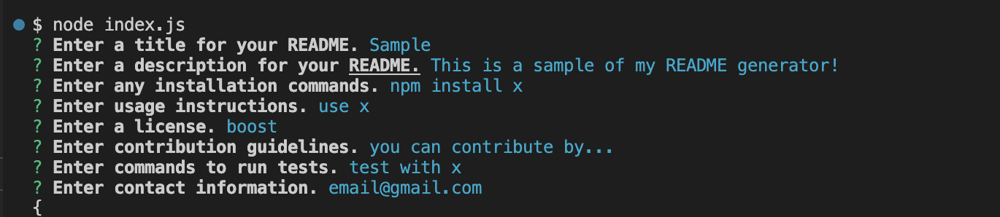
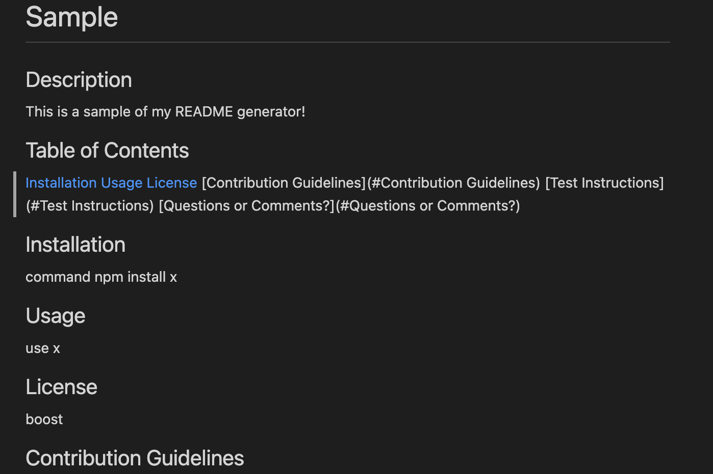

# README.md Generator

## Description

[Link to video demo](https://www.awesomescreenshot.com/video/11067342?key=6e8e1d6bd06ce013c1a7f144dc0623ec)

This is a README.md generator that can quickly create a professional README for any new project. The user can enter values for Description, Installation, Usage, License, Contributing, Tests, and Questions. 

## Screenshots

